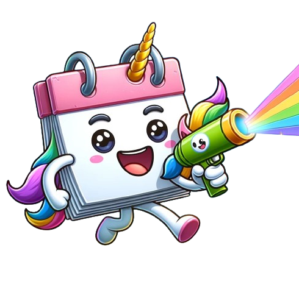
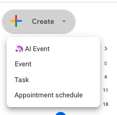

# 🦄 📆 Magic Cal

ChatGPT in Google Calendar -- a Chrome Extension

 

https://github.com/photomz/magic-cal/raw/main/cal-demo.mp4

Create Google Calendar events with AI -- **describe in words**. Type "Lunch with Ben tomorrow", and let AI magically translate it into a real calendar event!

Go to calendar.google.com > "+ Create" > "🦄 Magic Event"

- Uses ChatGPT (gpt-3.5-turbo), needs to be online.
- Email markuszhang8@gmail.com for help / bugs / complaints.

## 🖥️ Get

> Pending Chrome Web Store approval

## 👾 Developers

**Requires**: Chromium browser (Chrome, Arc, Firefox). This is, after all, a Chrome Extension.

Install packages for Vue Chrome Extension and Express server:

```sh
pnpm install
cd api
pnpm install
```

Start HMR dev servers:

```sh
pnpm dev
cd api
pnpm dev
```

Open <a href="chrome://extensions">chrome://extensions</a> on your browser, click "Load unpacked", and select folder:

```
your-path-to-magic-cal/dist
```

You should've loaded a local Chrome Extension.

To verify, go to <a href="https://calendar.google.com">calendar.google.com</a>, and click "+ Create". "🦄 Magic Event" should appear in the dropdown.
